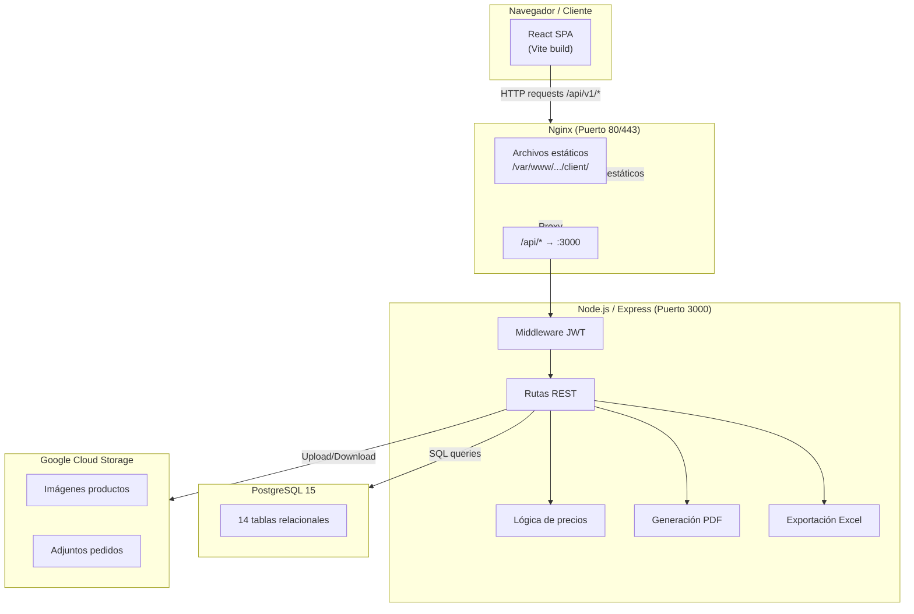
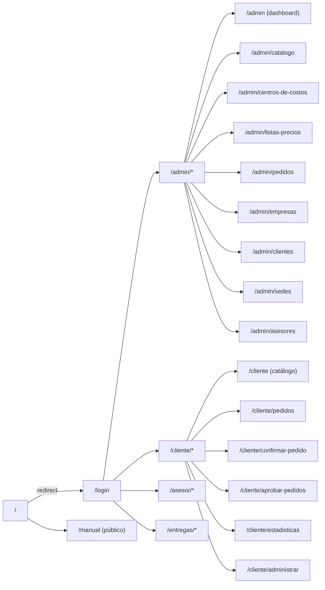
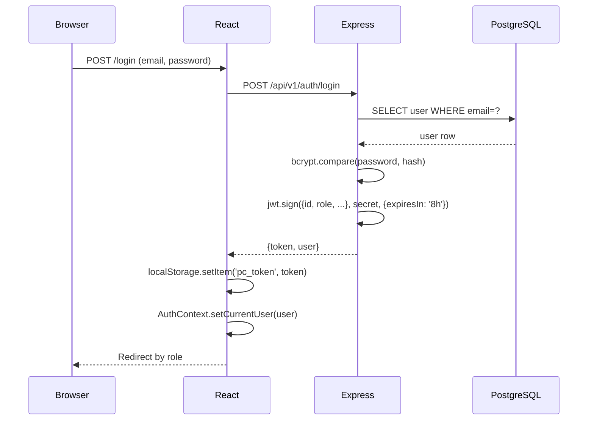

# Arquitectura del Sistema

## Visión general

Papelería Cartagena es una aplicación web B2B tipo SPA (Single Page Application) con backend REST y base de datos relacional. La arquitectura separa completamente frontend y backend, comunicados exclusivamente vía HTTP/JSON a través de un proxy Nginx.

---

## Diagrama de capas



---

## Estructura de rutas (Frontend)



---

## Sistema de autenticación

### Flujo de login



### Token y protección de rutas

- El token JWT se almacena en `localStorage` como `pc_token`
- Cada request HTTP incluye `Authorization: Bearer <token>`
- El middleware `requireAuth` en Express verifica firma y expiración
- `ProtectedRoute` en React verifica el rol y redirige a `/login` si no coincide
- Al montar `AuthProvider`, se llama `/auth/me` para rehidratar la sesión

### Roles del sistema

| Rol          | Sub-rol          | Descripción                                              |
|--------------|------------------|----------------------------------------------------------|
| `admin`      | —                | Acceso total: catálogo, pedidos, empresas, usuarios      |
| `advisor`    | —                | Ve pedidos de sus empresas asignadas                     |
| `client`     | `supervisor`     | Puede aprobar/rechazar pedidos de su sucursal            |
| `client`     | `creador_pedidos`| Crea pedidos (requiere aprobación del supervisor)        |
| `client`     | `admin_empresa`  | Vista de solo lectura del catálogo y reportes            |
| `delivery`   | —                | Ve pedidos en ruta asignados a su sede                   |

---

## Estado global (Context API)

### AuthContext (`src/context/AuthContext.jsx`)

```
AuthContext
├── currentUser: { id, name, email, role, clientRole, companyId, sucursalId, branchId, initials }
├── login(email, password) → user
├── logout()
└── loading: boolean
```

- Se inicializa llamando `GET /auth/me` con el token guardado
- `loading: true` mientras rehidrata (evita flash de redirect)

### AppContext (`src/context/AppContext.jsx`)

```
AppContext
├── categories[]           ← GET /categories
├── priceLists[]           ← GET /price-lists (admin)
├── products[]             ← GET /products (admin)
├── companies[]            ← GET /companies
├── branches[]             ← GET /branches
├── users[]                ← GET /users
├── orders[]               ← GET /orders (con paginación)
│
├── cart[]                 ← Estado local (no persiste)
│   ├── addToCart(product, qty, price)
│   ├── updateCartItem(productId, qty)
│   ├── removeFromCart(productId)
│   └── clearCart()
│
├── cartTotal              ← Calculado en tiempo real
├── cartCount              ← Número de ítems únicos
│
└── submitOrder(data)      ← POST /orders (con validación de precios)
```

- Los datos se cargan según el rol del usuario autenticado
- Los administradores cargan todos los recursos
- Los clientes solo ven su catálogo y sus pedidos
- `fetchAllPaginated()` maneja recursos con paginación

---

## Módulo de precios

La resolución de precio para un producto y un cliente sigue esta jerarquía (orden de precedencia):

```
1. price_list_items (precio explícito para ese producto en esa lista)
   ↓ si no existe
2. products.base_price × price_lists.multiplier
```

La lista de precios se resuelve así:

```
1. users.price_list_id (override personal del usuario)
   ↓ si null
2. sucursales.price_list_id (override de la sucursal)
   ↓ si null
3. companies.price_list_id (lista de la empresa)
```

El módulo `api/src/lib/pricing.js` implementa esta lógica en el backend.

---

## Módulo de pedidos

### Estados posibles

```
Pendiente por aprobar → Rechazado
Pendiente por aprobar → Pendiente
Pendiente → Validar disponibilidad
Validar disponibilidad → Alistamiento
Alistamiento → En Ruta
En Ruta → Entregado
```

### Identificadores de pedido

Los IDs se generan con la función PostgreSQL `fn_generate_order_id()`:
```
ORD-00001, ORD-00002, ...
```

---

## Arquitectura de archivos (produción)

```
/var/www/papeleria-cartagena/
├── client/           ← dist/ del build de React (servido por Nginx)
├── repo/             ← Repositorio git clonado
│   ├── api/          ← Backend Node.js (ejecutado por PM2)
│   └── infra/        ← Scripts de deploy
└── uploads/          ← Archivos subidos (si no se usa GCS)
```

---

## Proxy Nginx (desarrollo vs producción)

| Entorno     | Frontend                  | `/api/v1/*`                    |
|-------------|---------------------------|-------------------------------|
| Desarrollo  | Vite dev server (:5173)   | Proxy a Express (:3000)        |
| Producción  | Nginx sirve dist/ estático| Nginx proxy_pass a Express     |

La configuración del proxy en desarrollo está en `vite.config.js`:

```js
proxy: {
  '/api': { target: 'http://localhost:3000', changeOrigin: true },
  '/uploads': { target: 'http://localhost:3000', changeOrigin: true },
}
```
