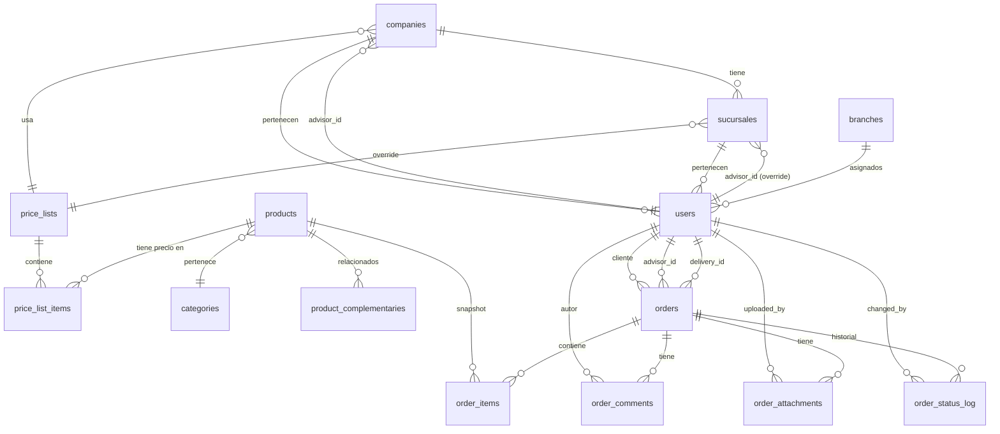

# Base de Datos

Motor: **PostgreSQL 15/18**
Nombre en producción: `papeleria_db`
Nombre en desarrollo: `papeleria_db_dev`

---

## Diagrama entidad-relación (simplificado)

---

## Diccionario de datos

### `companies` — Empresas cliente

| Columna        | Tipo          | Descripción                                      |
|----------------|---------------|--------------------------------------------------|
| `id`           | SERIAL PK     | Identificador único                              |
| `name`         | VARCHAR(200)  | Razón social de la empresa                       |
| `nit`          | VARCHAR(30)   | NIT (único, puede ser NULL)                      |
| `email`        | VARCHAR(150)  | Email de contacto principal                      |
| `phone`        | VARCHAR(30)   | Teléfono de contacto                             |
| `address`      | VARCHAR(300)  | Dirección principal                              |
| `price_list_id`| INTEGER FK    | Lista de precios asignada (puede ser overrideada por sucursal) |
| `advisor_id`   | INTEGER FK    | Asesor asignado por defecto                      |
| `active`       | BOOLEAN       | Empresa activa/inactiva                          |
| `created_at`   | TIMESTAMPTZ   | Fecha de creación                                |

---

### `sucursales` — Sucursales de empresas cliente

| Columna         | Tipo          | Descripción                                      |
|-----------------|---------------|--------------------------------------------------|
| `id`            | SERIAL PK     | Identificador único                              |
| `company_id`    | INTEGER FK    | Empresa a la que pertenece                       |
| `name`          | VARCHAR(150)  | Nombre de la sucursal                            |
| `city`          | VARCHAR(100)  | Ciudad                                           |
| `address`       | VARCHAR(300)  | Dirección de la sucursal                         |
| `advisor_id`    | INTEGER FK    | Override de asesor (si es NULL, hereda de company) |
| `price_list_id` | INTEGER FK    | Override de lista de precios (si es NULL, hereda de company) |
| `active`        | BOOLEAN       | Sucursal activa/inactiva                         |
| `created_at`    | TIMESTAMPTZ   | Fecha de creación                                |

---

### `branches` — Sedes internas de Papelería Cartagena

| Columna     | Tipo          | Descripción                          |
|-------------|---------------|--------------------------------------|
| `id`        | SERIAL PK     | Identificador único                  |
| `name`      | VARCHAR(150)  | Nombre de la sede (ej: "Cartagena")  |
| `city`      | VARCHAR(100)  | Ciudad                               |
| `address`   | VARCHAR(300)  | Dirección                            |
| `phone`     | VARCHAR(30)   | Teléfono                             |
| `active`    | BOOLEAN       | Sede activa/inactiva                 |
| `created_at`| TIMESTAMPTZ   | Fecha de creación                    |

---

### `price_lists` — Listas de precios

| Columna       | Tipo           | Descripción                                          |
|---------------|----------------|------------------------------------------------------|
| `id`          | SERIAL PK      | Identificador único                                  |
| `name`        | VARCHAR(100)   | Nombre (ej: "Lista A", "Lista B")                    |
| `description` | VARCHAR(200)   | Descripción opcional                                 |
| `multiplier`  | NUMERIC(5,4)   | Multiplicador sobre precio base (rango 0.0001–2.0000)|
| `created_at`  | TIMESTAMPTZ    | Fecha de creación                                    |

**Nota:** si `multiplier = 1.0`, el precio es igual al precio base del producto. Si `multiplier = 1.15`, es el precio base + 15%.

---

### `users` — Todos los usuarios del sistema

| Columna         | Tipo          | Descripción                                        |
|-----------------|---------------|----------------------------------------------------|
| `id`            | SERIAL PK     | Identificador único                                |
| `name`          | VARCHAR(200)  | Nombre completo                                    |
| `email`         | VARCHAR(150)  | Email único (usado para login)                     |
| `password_hash` | VARCHAR(255)  | Hash bcrypt de la contraseña                       |
| `role`          | VARCHAR(20)   | `admin` / `advisor` / `client` / `delivery`        |
| `client_role`   | VARCHAR(30)   | Solo clientes: `supervisor` / `creador_pedidos` / `admin_empresa` |
| `company_id`    | INTEGER FK    | Solo clientes: empresa a la que pertenece          |
| `sucursal_id`   | INTEGER FK    | Solo clientes: sucursal a la que pertenece         |
| `branch_id`     | INTEGER FK    | Solo asesores/repartidores: sede asignada          |
| `price_list_id` | INTEGER FK    | Override personal de lista de precios              |
| `contact_name`  | VARCHAR(200)  | Nombre de contacto de entrega                      |
| `phone`         | VARCHAR(30)   | Teléfono                                           |
| `address`       | VARCHAR(300)  | Dirección de entrega                               |
| `initials`      | VARCHAR(5)    | Iniciales para el avatar (ej: "JD")                |
| `active`        | BOOLEAN       | Usuario activo/inactivo                            |
| `created_at`    | TIMESTAMPTZ   | Fecha de creación                                  |

**Constraints de integridad:**
- Los clientes DEBEN tener `company_id` y `sucursal_id`
- Los asesores y repartidores DEBEN tener `branch_id`
- `client_role` solo aplica cuando `role = 'client'`
- Usuarios no-client NO pueden tener `company_id`, `sucursal_id`, ni `client_role`

---

### `categories` — Categorías / Centros de costo

| Columna       | Tipo          | Descripción                         |
|---------------|---------------|-------------------------------------|
| `id`          | SERIAL PK     | Identificador único                 |
| `name`        | VARCHAR(150)  | Nombre único de la categoría        |
| `description` | VARCHAR(300)  | Descripción opcional                |
| `active`      | BOOLEAN       | Categoría activa/inactiva           |
| `created_at`  | TIMESTAMPTZ   | Fecha de creación                   |

Las relaciones entre categorías (para cross-selling) se almacenan en la tabla intermedia `category_relations` (gestionada via `PUT /categories/:id/related`).

---

### `products` — Catálogo de productos

| Columna       | Tipo           | Descripción                              |
|---------------|----------------|------------------------------------------|
| `id`          | SERIAL PK      | Identificador único                      |
| `name`        | VARCHAR(300)   | Nombre del producto                      |
| `sku`         | VARCHAR(50)    | Código único de referencia               |
| `category_id` | INTEGER FK     | Categoría a la que pertenece             |
| `description` | TEXT           | Descripción detallada                    |
| `base_price`  | NUMERIC(12,2)  | Precio base (> 0)                        |
| `stock`       | INTEGER        | Unidades disponibles (≥ 0)               |
| `unit`        | VARCHAR(50)    | Unidad de medida (ej: "und", "caja")     |
| `image_url`   | TEXT           | URL imagen en Google Cloud Storage       |
| `active`      | BOOLEAN        | Producto activo/inactivo                 |
| `created_at`  | TIMESTAMPTZ    | Fecha de creación                        |

---

### `product_complementaries` — Productos complementarios (cross-selling)

| Columna           | Tipo        | Descripción                    |
|-------------------|-------------|--------------------------------|
| `product_id`      | INTEGER FK  | Producto principal             |
| `complementary_id`| INTEGER FK  | Producto complementario        |

PK compuesta: `(product_id, complementary_id)`. Auto-referenciada sin reflexividad (`product_id <> complementary_id`).

---

### `price_list_items` — Precios explícitos por lista

| Columna         | Tipo           | Descripción                                     |
|-----------------|----------------|-------------------------------------------------|
| `id`            | SERIAL PK      | Identificador único                             |
| `product_id`    | INTEGER FK     | Producto                                        |
| `price_list_id` | INTEGER FK     | Lista de precios                                |
| `price`         | NUMERIC(12,2)  | Precio específico para esta combinación (> 0)   |
| `currency`      | CHAR(3)        | Moneda (default: `COP`)                         |
| `created_at`    | TIMESTAMPTZ    | Fecha de creación                               |
| `updated_at`    | TIMESTAMPTZ    | Última actualización (trigger automático)        |

UNIQUE `(product_id, price_list_id)` — un precio por producto por lista.

---

### `orders` — Pedidos

| Columna       | Tipo           | Descripción                                               |
|---------------|----------------|-----------------------------------------------------------|
| `id`          | VARCHAR(20) PK | ID generado: `ORD-00001`, `ORD-00002`, ...               |
| `client_id`   | INTEGER FK     | Usuario cliente que creó el pedido                        |
| `advisor_id`  | INTEGER FK     | Asesor asignado (puede ser NULL)                          |
| `delivery_id` | INTEGER FK     | Repartidor asignado (puede ser NULL)                      |
| `delivered_by`| INTEGER FK     | Usuario que marcó como entregado                          |
| `delivered_at`| TIMESTAMPTZ    | Fecha/hora de entrega efectiva                            |
| `status`      | VARCHAR(50)    | Estado actual del pedido                                  |
| `notes`       | TEXT           | Notas del cliente                                         |
| `carrier`     | VARCHAR(100)   | Transportista o descripción del medio de entrega          |
| `total`       | NUMERIC(14,2)  | Total del pedido (≥ 0)                                    |
| `created_at`  | TIMESTAMPTZ    | Fecha de creación                                         |
| `updated_at`  | TIMESTAMPTZ    | Última actualización (trigger automático)                 |

**Estados válidos:** `Pendiente por aprobar` → `Rechazado` / `Pendiente` → `Validar disponibilidad` → `Alistamiento` → `En Ruta` → `Entregado`

---

### `order_items` — Ítems de pedido (snapshot histórico)

| Columna        | Tipo           | Descripción                                      |
|----------------|----------------|--------------------------------------------------|
| `id`           | SERIAL PK      | Identificador único                              |
| `order_id`     | VARCHAR(20) FK | Pedido al que pertenece                          |
| `product_id`   | INTEGER FK     | Producto (referencia, no se elimina en cascada)  |
| `product_name` | VARCHAR(300)   | **Snapshot** del nombre al momento del pedido    |
| `sku`          | VARCHAR(50)    | **Snapshot** del SKU al momento del pedido       |
| `quantity`     | INTEGER        | Cantidad pedida (> 0)                            |
| `unit_price`   | NUMERIC(12,2)  | **Snapshot** del precio al momento del pedido    |
| `unit`         | VARCHAR(50)    | **Snapshot** de la unidad al momento del pedido  |

**Importante:** los campos de snapshot (`product_name`, `sku`, `unit_price`, `unit`) guardan los valores al momento de crear el pedido, independientemente de cambios futuros en el catálogo.

---

### `order_comments` — Comentarios internos

| Columna     | Tipo          | Descripción                       |
|-------------|---------------|-----------------------------------|
| `id`        | SERIAL PK     | Identificador único               |
| `order_id`  | VARCHAR(20)   | Pedido al que pertenece           |
| `author_id` | INTEGER FK    | Usuario que escribió el comentario|
| `text`      | TEXT          | Contenido del comentario          |
| `created_at`| TIMESTAMPTZ   | Fecha del comentario              |

---

### `order_attachments` — Adjuntos de pedido

| Columna       | Tipo          | Descripción                                              |
|---------------|---------------|----------------------------------------------------------|
| `id`          | SERIAL PK     | Identificador único                                      |
| `order_id`    | VARCHAR(20)   | Pedido al que pertenece                                  |
| `file_name`   | VARCHAR(300)  | Nombre original del archivo                              |
| `file_size`   | BIGINT        | Tamaño en bytes                                          |
| `mime_type`   | VARCHAR(100)  | Tipo MIME (ej: `application/pdf`)                        |
| `file_url`    | TEXT          | URL en GCS o ruta local                                  |
| `type`        | VARCHAR(30)   | Categoría: `general`, `evidence`, `invoice`, `receipt`, `purchase_order` |
| `uploaded_by` | INTEGER FK    | Usuario que subió el archivo                             |
| `uploaded_at` | TIMESTAMPTZ   | Fecha de subida                                          |

---

### `order_status_log` — Auditoría de cambios de estado

| Columna       | Tipo          | Descripción                              |
|---------------|---------------|------------------------------------------|
| `id`          | SERIAL PK     | Identificador único                      |
| `order_id`    | VARCHAR(20)   | Pedido al que pertenece                  |
| `from_status` | VARCHAR(50)   | Estado anterior (NULL si es el primero)  |
| `to_status`   | VARCHAR(50)   | Estado nuevo                             |
| `changed_by`  | INTEGER FK    | Usuario que realizó el cambio            |
| `reason`      | TEXT          | Motivo del cambio (opcional)             |
| `created_at`  | TIMESTAMPTZ   | Fecha del cambio                         |

---

## Índices de rendimiento

Los índices clave para performance de consultas:

| Índice                          | Tabla / Columna(s)                      |
|---------------------------------|-----------------------------------------|
| `idx_users_email`               | `users(email)` — login                  |
| `idx_users_role`                | `users(role)` — filtros por rol         |
| `idx_users_company`             | `users(company_id)`                     |
| `idx_orders_client`             | `orders(client_id)`                     |
| `idx_orders_status`             | `orders(status)` — filtros de estado    |
| `idx_orders_created_at`         | `orders(created_at DESC)` — listados    |
| `idx_osl_order`                 | `order_status_log(order_id, created_at)`|
| `idx_pli_product`               | `price_list_items(product_id)`          |
| `idx_products_sku`              | `products(sku)` — búsquedas por código  |
| `idx_products_active`           | `products(active)` — catálogo activo    |

---

## Funciones y triggers

| Nombre                            | Tabla       | Descripción                              |
|-----------------------------------|-------------|------------------------------------------|
| `fn_update_orders_updated_at()`   | `orders`    | Actualiza `updated_at` en cada UPDATE    |
| `fn_update_pli_updated_at()`      | `price_list_items` | Igual para items de lista         |
| `fn_generate_order_id()`          | `orders`    | Genera `ORD-NNNNN` único al insertar     |

---

## Migraciones

Las migraciones están en `infra/migrations/` numeradas secuencialmente:

| Archivo                                        | Cambio                                         |
|------------------------------------------------|------------------------------------------------|
| `001_price_list_items.sql`                     | Tabla de precios por lista                     |
| `002_order_status_log.sql`                     | Auditoría de estados                           |
| `003_role_delivery.sql`                        | Rol de repartidor                              |
| `004_attachment_type.sql`                      | Tipos de adjuntos                              |
| `005_purchase_order_attachment.sql`            | Tipo `purchase_order`                          |
| `006_company_advisor_branch_overrides.sql`     | Asesor y lista de precio por sucursal          |
| `007_admin_empresa_and_delivery_assignment.sql`| Rol `admin_empresa` y asignación de repartidor |
| `008_order_delivery_completion.sql`            | Campos `delivered_by` y `delivered_at`         |
| `009_decouple_user_price_list.sql`             | Override de lista de precios por usuario       |
| `010_category_relations_and_company_budget.sql`| Relaciones entre categorías                    |
| `011_order_item_changes.sql`                   | Cambios en ítems de pedido post-creación       |

El archivo `infra/migrate.sql` contiene el schema completo consolidado (todas las migraciones aplicadas).
