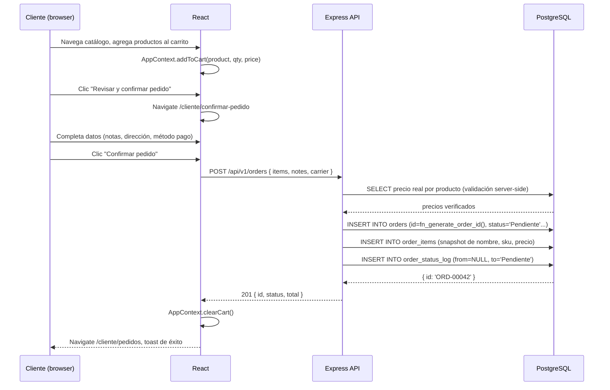
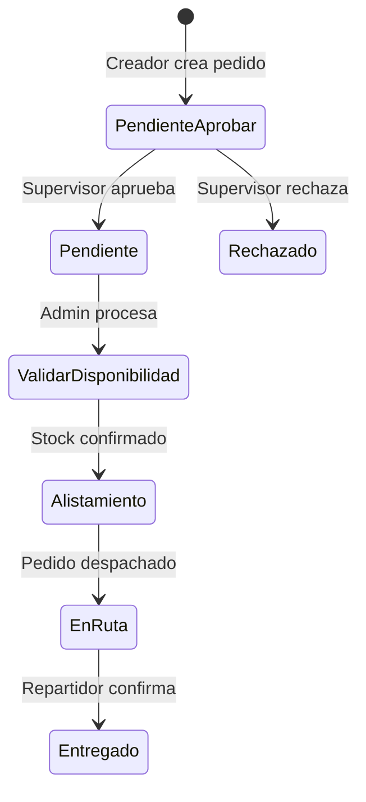
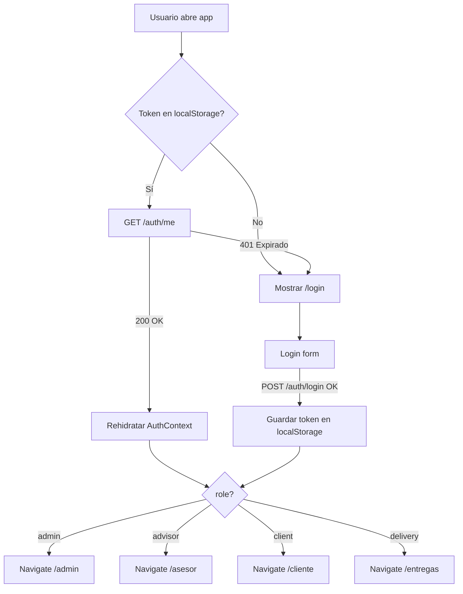
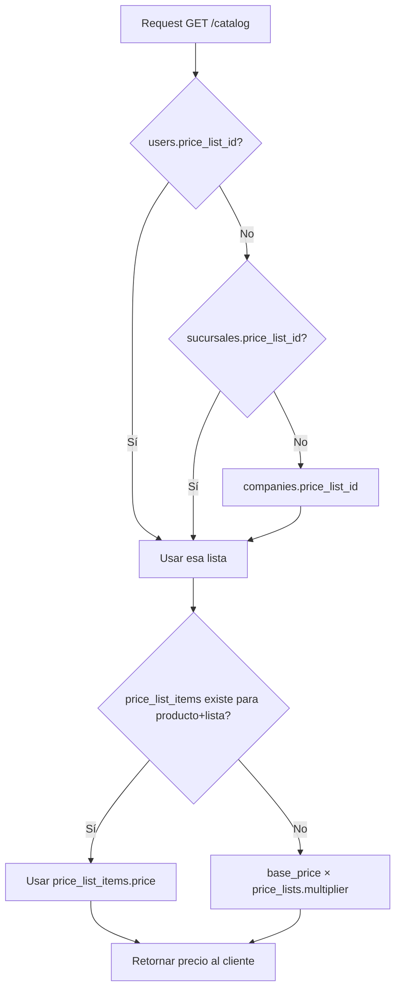
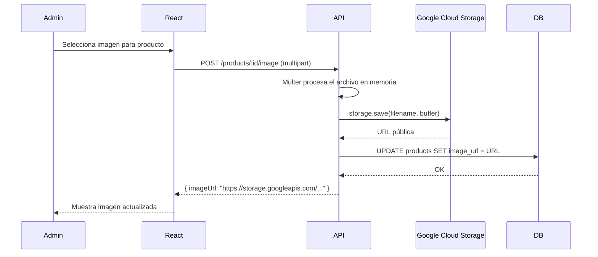
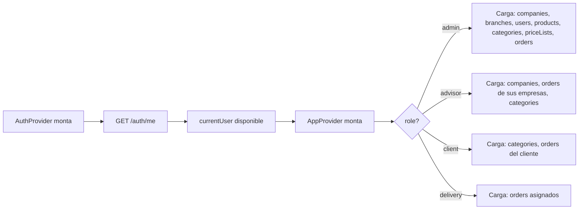

# Flujos Críticos del Sistema

---

## 1. Flujo de creación de pedido (cliente)



**Puntos críticos:**
- El backend valida y recalcula los precios (no confía en el total del frontend)
- Si el cliente tiene `clientRole = 'creador_pedidos'` y hay supervisor, el status inicial puede ser `Pendiente por aprobar`
- El ID del pedido se genera en PostgreSQL con `fn_generate_order_id()`

---

## 2. Flujo de aprobación (supervisor)

Aplica cuando `clientRole = 'creador_pedidos'` y existe un supervisor en la misma sucursal.



**Actores:**
- `creador_pedidos` → crea el pedido
- `supervisor` → aprueba/rechaza pedidos de su sucursal
- `admin` → procesa pedidos aprobados
- `delivery` → marca En Ruta y Entregado

---

## 3. Flujo de autenticación y sesión



---

## 4. Resolución de precios



---

## 5. Flujo de gestión de imágenes de productos



---

## 6. Flujo de exportación de pedido (PDF / Excel)

El admin puede generar documentos para un pedido:

1. **Orden de compra (PDF):** `api/src/lib/purchaseOrderPdf.js` con PDFKit
2. **Exportación Excel:** `api/src/lib/orderExport.js` con ExcelJS

```
Admin → GET /orders/:id/pdf → PDFKit genera buffer → Response con Content-Type: application/pdf
Admin → GET /orders/:id/export → ExcelJS genera xlsx → Response con Content-Type: application/vnd.openxmlformats...
```

---

## 7. Flujo de sincronización de datos (AppContext)



Los datos se recargan con `refreshXxx()` después de operaciones CRUD para mantener el estado consistente.

---

## 8. Flujo de cambio de estado de pedido

Solo roles autorizados pueden cambiar a ciertos estados:

| Transición                                 | Rol requerido         |
|--------------------------------------------|-----------------------|
| `Pendiente por aprobar` → `Pendiente`      | `supervisor`          |
| `Pendiente por aprobar` → `Rechazado`      | `supervisor`          |
| `Pendiente` → `Validar disponibilidad`     | `admin`               |
| `Validar disponibilidad` → `Alistamiento`  | `admin`               |
| `Alistamiento` → `En Ruta`                 | `admin`               |
| `En Ruta` → `Entregado`                    | `admin` / `delivery`  |

Cada cambio genera un registro en `order_status_log` con `from_status`, `to_status`, `changed_by`, y `reason` opcional.

---

## 9. Gestión de inventario

El campo `products.stock` se decrementa automáticamente al confirmar un pedido.

```sql
-- Ejemplo de decremento (en api/src/routes/orders.js al crear pedido)
UPDATE products SET stock = stock - $quantity WHERE id = $productId
```

**Alerta de stock bajo:** el frontend muestra "Pocas unidades" cuando `stock < 20 AND stock > 0`.

---

## 10. Notificaciones y comunicación

La plataforma **no tiene notificaciones push en tiempo real** (sin WebSockets). El flujo de notificación es:

1. Cliente crea pedido → el asesor asignado lo ve en su panel de pedidos al recargar/navegar
2. El asesor contacta al cliente por medios externos (teléfono, email) para coordinar entrega
3. El cliente hace polling manual recargando la sección "Pedidos"
